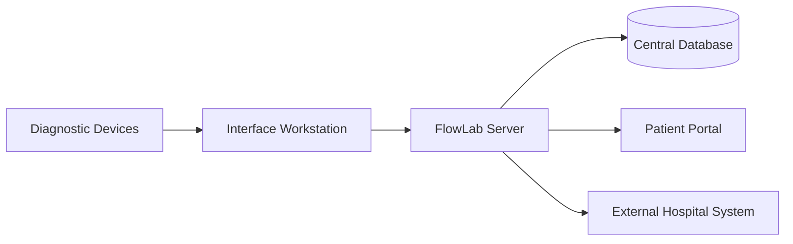
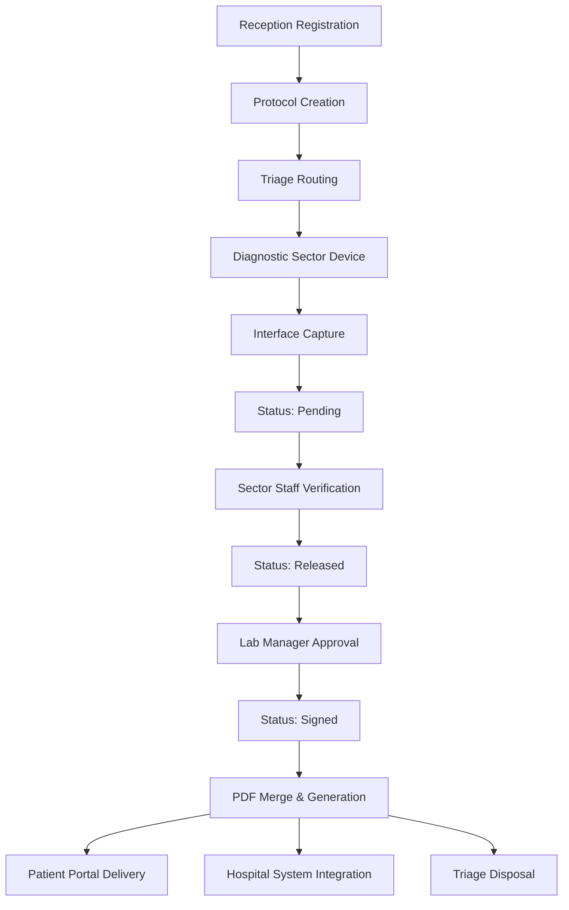
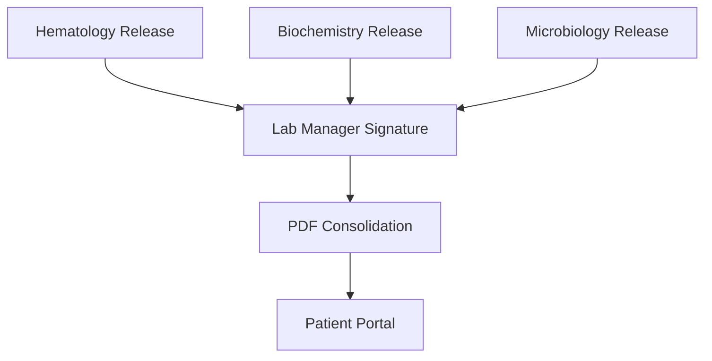

# FlowLab System Diagrams

This section visualizes the FlowLab laboratory workflow using Mermaid diagrams.  
They reflect the operational flow described in the Overview and are designed for clarity, portfolio presentation, and technical documentation.

---

## 1 — System Data Architecture

This diagram shows how laboratory devices communicate with the FlowLab ecosystem.


**Conceptual flow**

- Devices generate exam data.
- Interface translates machine output into structured records.
- FlowLab processes, stores, and distributes results.
- External systems may receive data through REST integration.

---

## 2 — End-to-End Laboratory Workflow

This diagram represents the operational lifecycle of a patient sample.



**Status lifecycle**

```
Pending → Released → Signed → Report Generated
```

---

## 3 — Sector Consolidation Flow

This diagram illustrates how multiple laboratory sectors converge into a single patient report.



**Operational logic**

- Each sector validates only its own exams.
- Manager approval ensures cross-sector accountability.
- A single unified report is generated per patient protocol.

---

## Diagram Philosophy

These diagrams prioritize:

- operational clarity
- real workflow representation
- technical communication
- portfolio readability

They are intentionally abstracted to protect sensitive implementation details while preserving architectural meaning.
